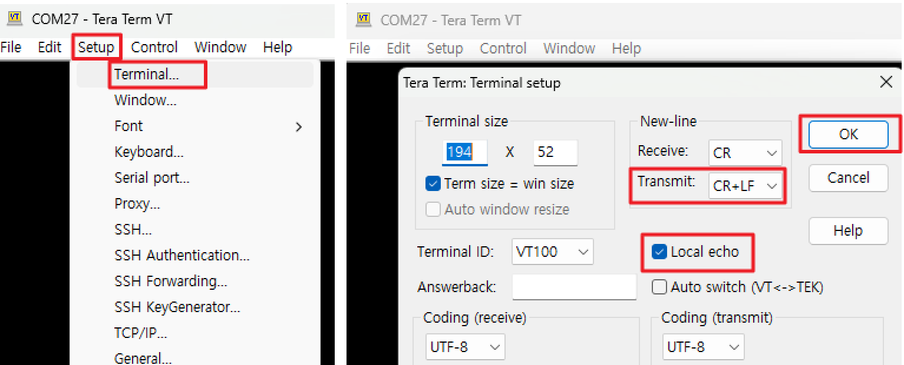
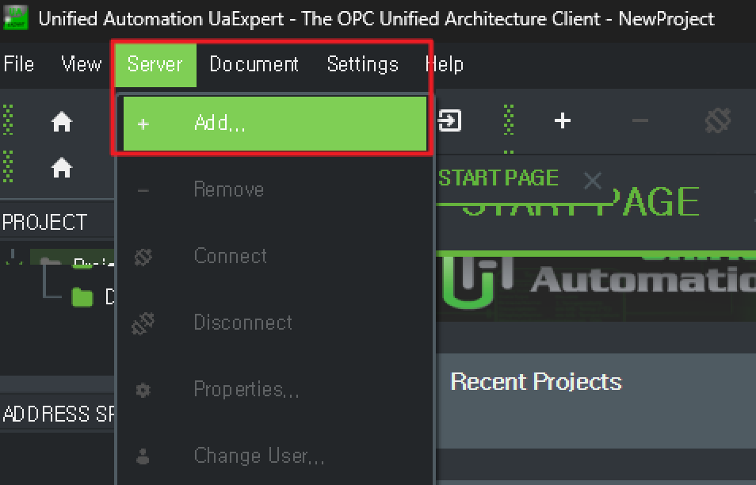
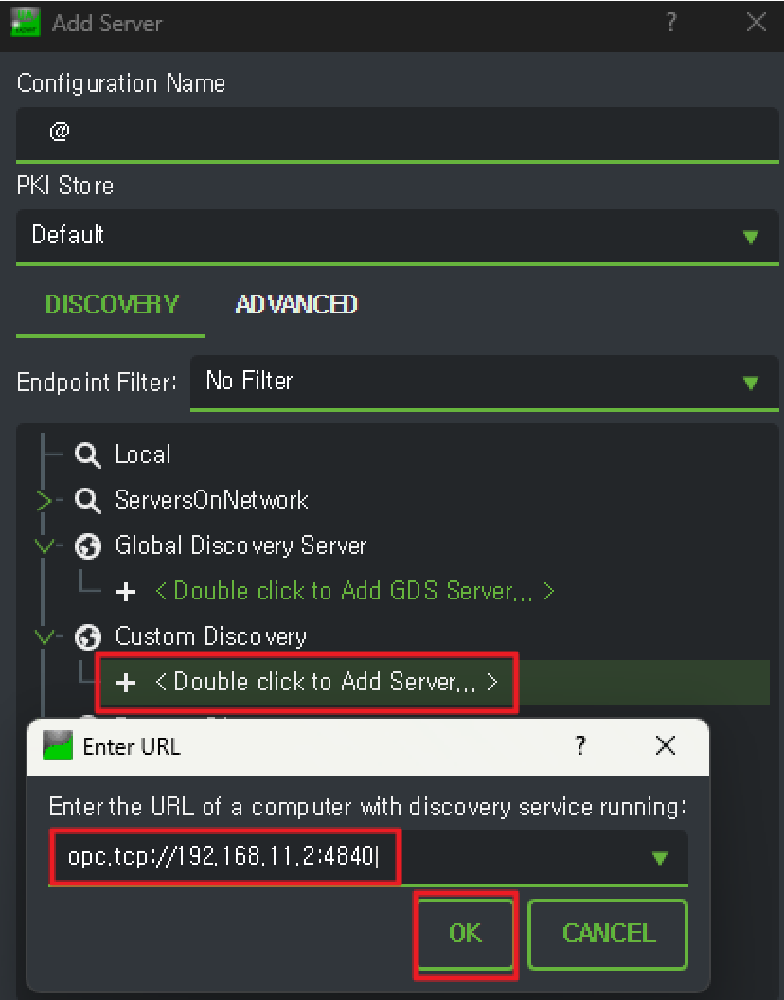
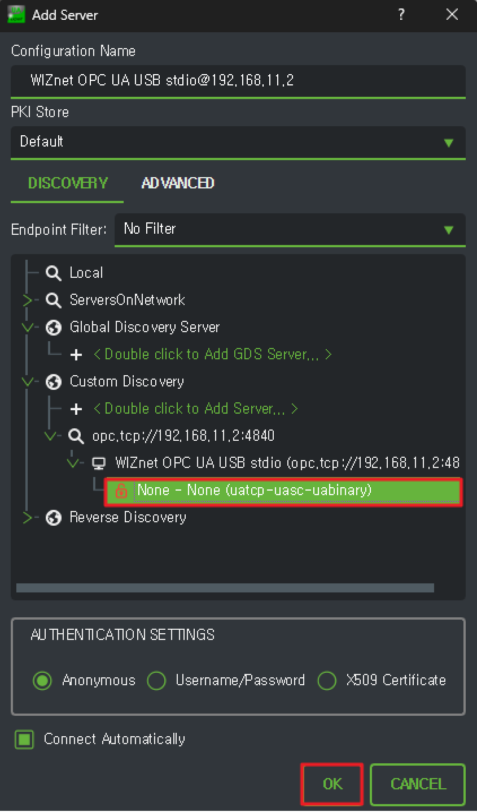
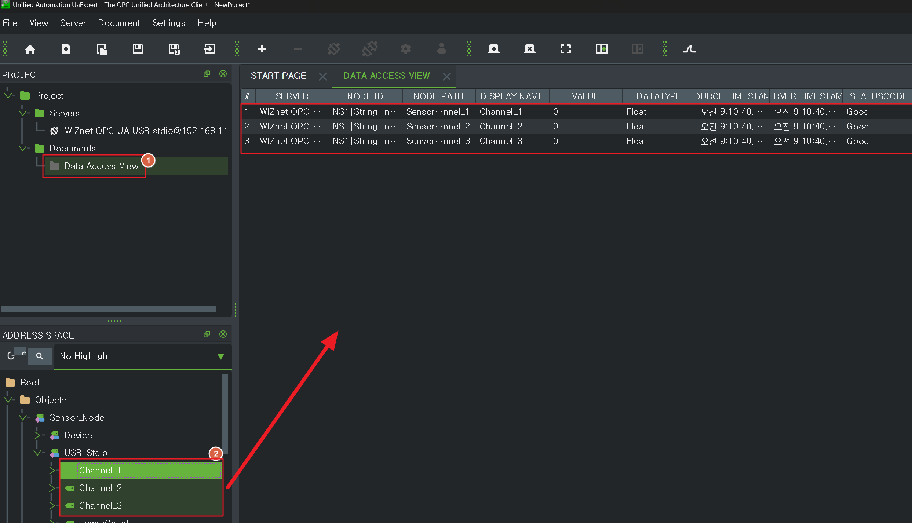
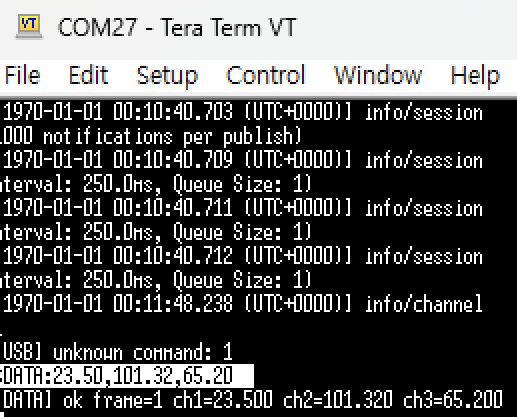
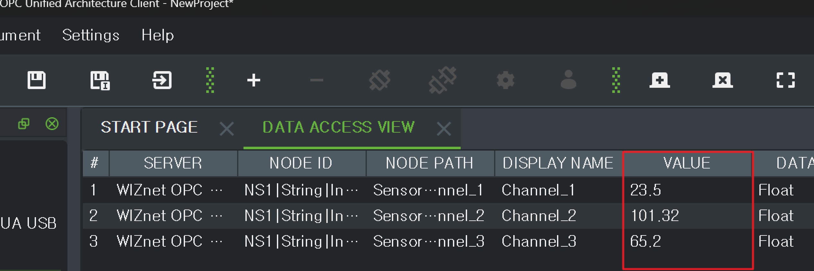

# OPC UA USB stdio 예제

WIZnet W6300 + RP2350 보드에서 OPC UA 서버를 실행하고,
USB 시리얼(Tera Term)로 센서 데이터를 입력하면 UAExpert에서 실시간으로 확인하는 예제입니다.

---

## 필요한 소프트웨어

| 소프트웨어 | 용도 | 다운로드 |
|-----------|------|---------|
| Tera Term | USB 시리얼 통신 | https://teratermproject.github.io |
| UaExpert | OPC UA 클라이언트 | https://www.unified-automation.com/downloads/opc-ua-clients.html |

---

## 1. 펌웨어 업로드

빌드 후 생성된 `opcua_usb_stdio.uf2` 파일을 보드에 업로드합니다.

1. 보드의 **BOOTSEL 버튼을 누른 채로** USB 케이블 연결
   (또는 BOOTSEL 버튼을 누른 채로 RESET 버튼 누르기)
2. PC에서 드라이브로 인식되면 `opcua_usb_stdio.uf2` 파일을 드래그 앤 드롭
3. 보드가 자동으로 재시작됨

### Tera Term 확인

1. Tera Term 실행 → COM 포트 선택 후 접속
2. 아래와 같은 로그가 출력되면 정상입니다

```
=== WIZnet OPC UA USB stdio prototype ===
USB CDC input is active on the RP2350 USB-C port.
[WIZnet] initializing WIZnet network
...
[OPC UA] state=RUNNING endpoint=opc.tcp://192.168.11.2:4840
```

### 에코 및 줄바꿈 설정

Tera Term에서 입력한 명령어가 화면에 표시되도록 설정합니다.

**Setup → Terminal** 메뉴에서:
- **Transmit**: `CR` → `CR+LF` 로 변경
- **Local echo** 체크박스 체크



---

## 2. UaExpert 서버 추가

1. UaExpert 상단 메뉴 **Server → Add...** 클릭



2. **Custom Discovery** 아래 `< Double click to Add Server... >` 더블클릭

3. 주소 입력창에 아래 주소 입력 후 엔터

```
opc.tcp://192.168.11.2:4840
```



---

## 3. 보안 없음(None) 선택 후 연결

탐색된 서버 목록에서:

1. `WIZnet OPC UA USB stdio` 아래 **None - None (uatcp-uasc-uabinary)** 선택
2. **OK** 클릭

> 현재 버전은 보안 설정 없이 동작합니다 (SecurityPolicy: None)



---

## 4. Data Access View에서 노드 확인

연결 후 왼쪽 **ADDRESS SPACE** 패널에서 노드 트리를 확인합니다.

```
Root
└── Objects
    └── Sensor_Node
        ├── Device
        │   ├── DeviceName
        │   ├── IPAddress
        │   ├── FwVersion
        │   └── Uptime_s
        └── USB_Stdio
            ├── Channel_1
            ├── Channel_2
            ├── Channel_3
            ├── RawFrame
            ├── FrameCount
            └── ParseErrorCount
```

1. 상단 탭에서 **DATA ACCESS VIEW** 클릭
2. `USB_Stdio` 펼치기
3. `Channel_1`, `Channel_2`, `Channel_3` 을 오른쪽 DATA ACCESS VIEW 패널로 **드래그**



---

## 5. Tera Term으로 데이터 전송

Tera Term에서 아래 명령어 입력:

```
$DATA:23.50,101.32,65.20
```



---

## 6. UaExpert에서 실시간 값 확인

DATA ACCESS VIEW에서 Channel_1/2/3 값이 업데이트되는 것을 확인합니다.



---

## 기타 명령어

| 명령어 | 설명 |
|--------|------|
| `$DATA:<ch1>,<ch2>,<ch3>` | 채널 값 입력 (소수점 포함) |
| `GET` | 현재 채널 값 출력 |
| `NET` | 네트워크 상태 확인 |
| `OPCUA` | OPC UA 서버 상태 확인 |
| `CLEAR` | 채널 값 초기화 |
| `HELP` | 명령어 목록 출력 |
